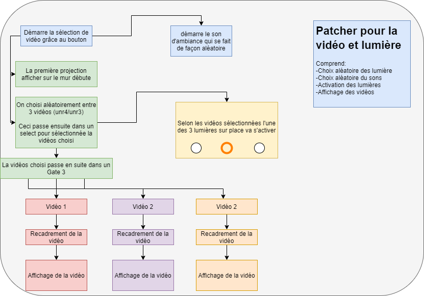
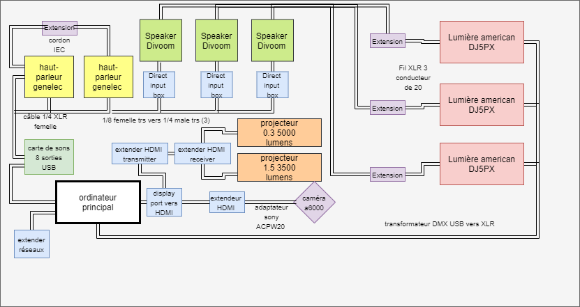
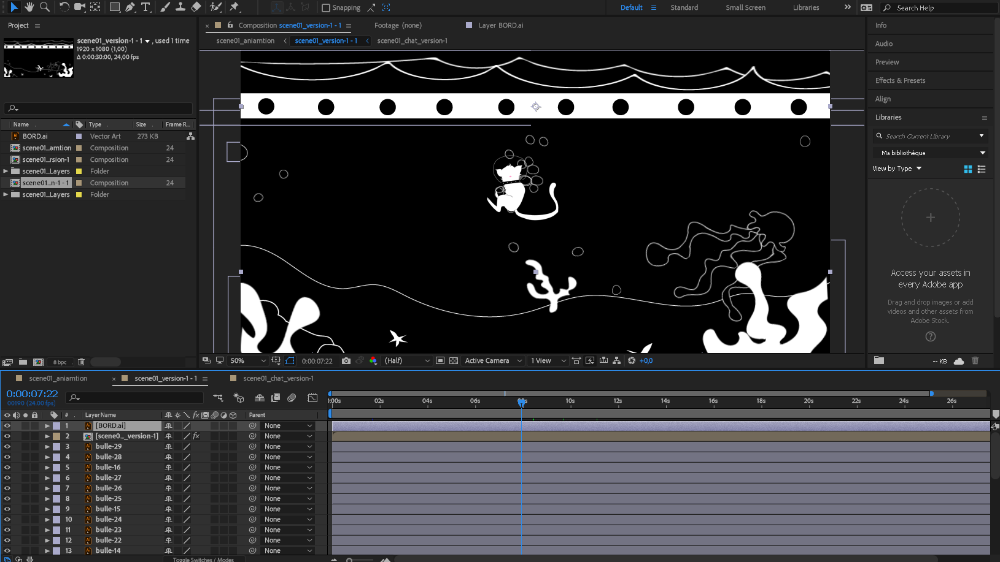
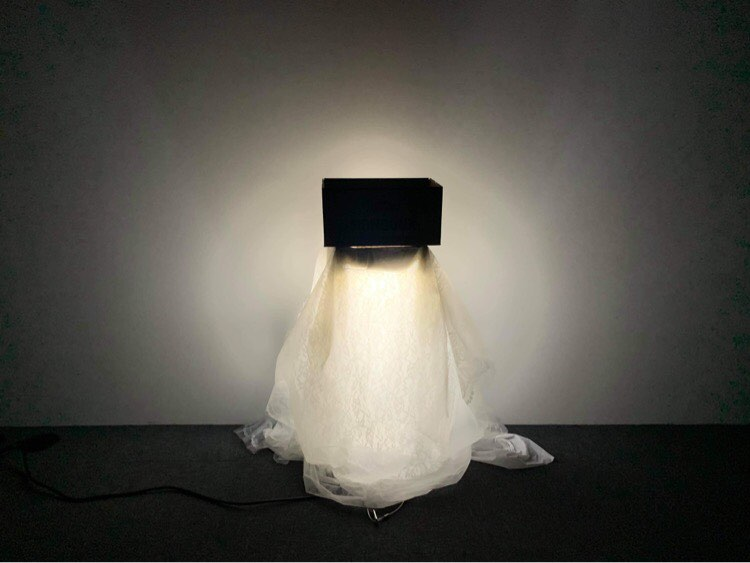
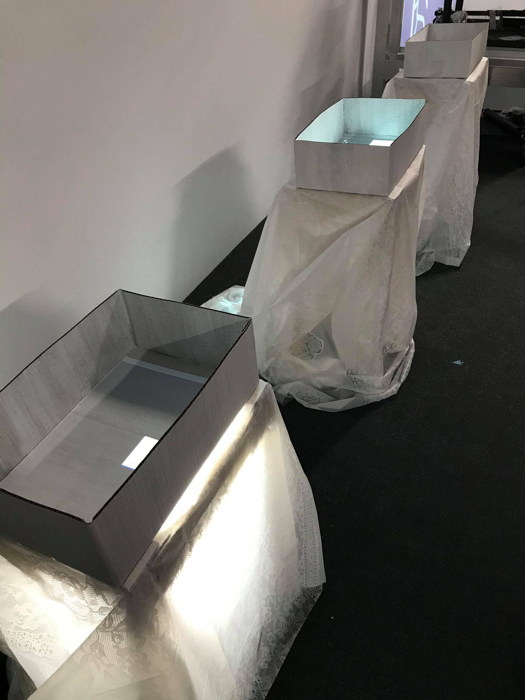
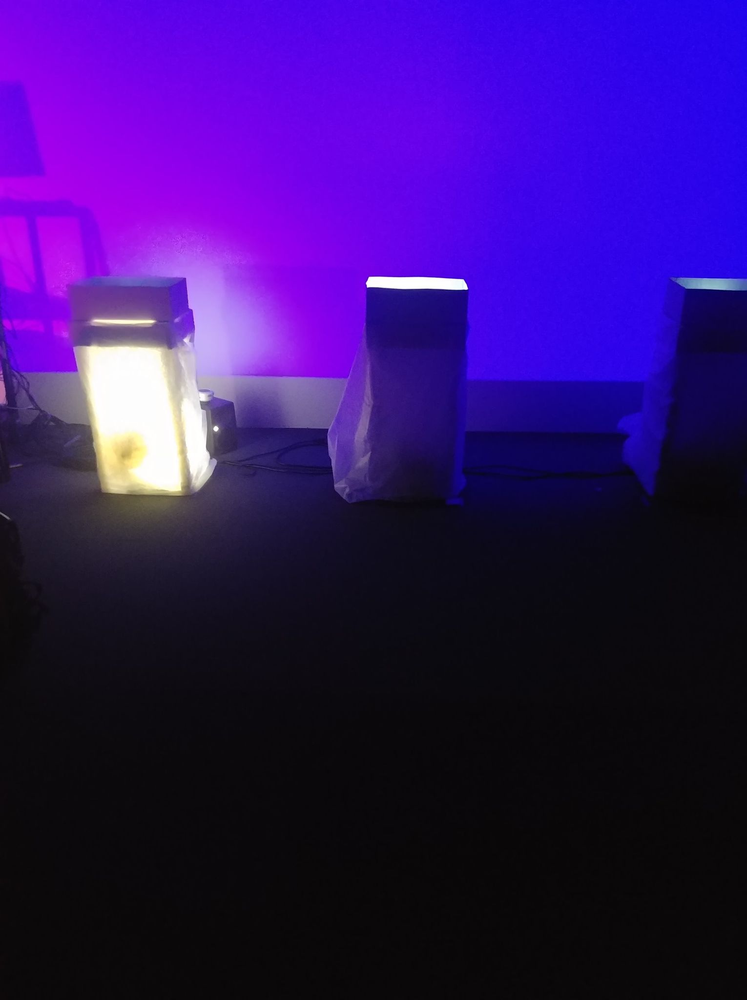
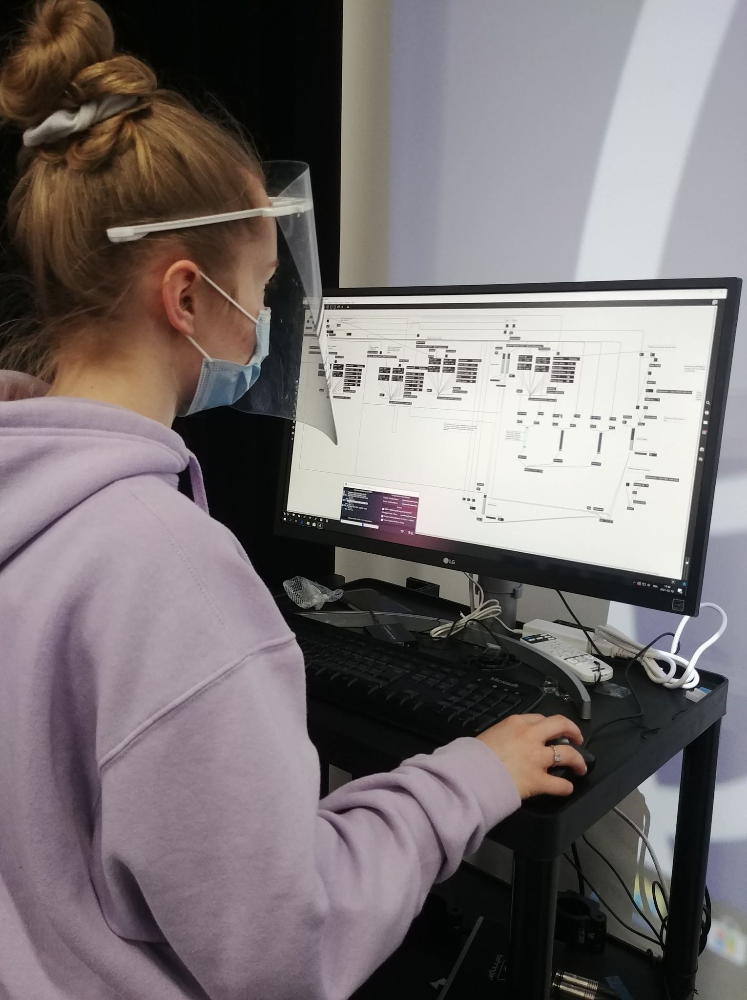
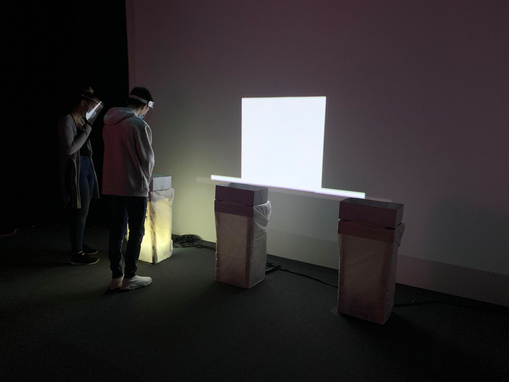

# Journal de "Catherine Côté"

## Table des matières
- [Semaine 0 (25 au 29 janvier)](#Semaine-0-(25-au-29-janvier))
- [Semaine 1 (30 janvier au 5 février)](#Semaine-1-(30-janvier-au-5-février))
- [Semaine 2 (6 au 12 février)](#Semaine-2-(6-au-12-février))
- [Semaine 3 (13 au 19 février)](#Semaine-3-(13-au-19-février))
- [Semaine 4 (20 au 26 février)](#Semaine-4-(20-au-26-février))
- [Semaine 5 (6 au 12 mars)](#Semaine-5-(6-au-12-mars))
- [Semaine 6 (13 au 19 mars)](#Semaine-6-(13-au-19-mars))

---
## Semaine 0 (25 au 29 janvier)

### Résumé des réalisations effectuées
- Modifier le mon journal respectif
- Ajouter les dossiers du model de projet
- Ajout des tâches en cours dans le Kaban
- commencer la preproduction (planification technique)

### Image d'une réalisation dont tu es la ou le plus fier

### Est-ce que j'ai accompli l'ensemble des tâches et objectifs que je m'étais fixés pour cette semaine?	
- [x] Complètement
- [ ] Assez
- [ ] Peu
- [ ] Pas du tout

#### Décrivez pourquoi.
J'ai terminer avec mon équipe l'organisation du GitHub. Comme par exemple, rajouter le model de projet, modifier les tâches du Kaban et modifier mon journal qui m'est attribué. J'ai également avancer la planification technique pour le préproduction qui sera à remettre.

### Mon projet s'est-il réalisé selon l’échéancier prévu?

- [ ] Complètement
- [x] Assez
- [ ] Un peu
- [ ] Pas tout à fait

#### S'il y a des écarts, décrivez-les.
Il y a certaine partie dans la planification technique qui doivent être revériféier avec mon équipe avant la présentation de la preproduction.

#### S'il y a lieu, qu'allez-vous faire pour remédier à la situation?
Une rencontre sera organisé pour confirmé par exemple certaine date et certain détail des matériaux utilisé.

### Défis pour la prochaine semaine
Compléter la préproduction 

---
## Semaine 1 (30 janvier au 5 février)
### Résumé des réalisations effectuées
- schéma de plantation
- schéma de fonctionnement
- schéma de branchement [en cours]
- avancement de la liste de matériel [en cours]
- liste de logiciel utilisé
- liste de matériel scénographie
- ressource humaine requise
- ressource spatial requise
- commencer les illustrations pour les animations

### Image d'une réalisation dont tu es la ou le plus fier

### Est-ce que j'ai accompli l'ensemble des tâches et objectifs que je m'étais fixés pour cette semaine?

- [x] Complètement
- [ ] Assez
- [ ] Peu
- [ ] Pas du tout

#### Décrivez pourquoi.
 J'ai pu terminer ou très bien avancer toutes mes tâches de cette semaine. J'ai même pu tranquilllement commencer les illustrations dédiés à mon animation qui se déroule dans un grand aquarium. De plus, mon équipe et moi avons pu mettre au clair plusieurs point de notre production.

#### S'il y a lieu, qu'allez-vous faire pour remédier à la situation?
Pour la liste de matériel et le schéma de branchement j'ai dejà pris rendez-vous avec le TTP pour pouvoir compléter ce qui me manque.

### Mon projet s'est-il réalisé selon l’échéancier prévu?

- [x] Complètement
- [ ] Assez
- [ ] Un peu
- [ ] Pas tout à fait

#### S'il y a des écarts, décrivez-les.

#### S'il y a lieu, qu'allez-vous faire pour remédier à la situation?

### Défis pour la prochaine semaine
-terminer la liste de matériel avec le schéma de branchement
-terminer et remettre la préprduction pour mardi le 9 février

---
## Semaine 2 (6 au 12 février)
### Résumé des réalisations effectuées
- compléter et remis la préproduction
- compléter et envoyer la liste de matériel officiel pour le projet
- terminer mes illustration pour mes animations
- terminer mes animations pour mon projet

### Image d'une réalisation dont tu es la ou le plus fier

### Est-ce que j'ai accompli l'ensemble des tâches et objectifs que je m'étais fixés pour cette semaine?

- [x] Complètement
- [ ] Assez
- [ ] Peu
- [ ] Pas du tout

#### Décrivez pourquoi.
 J'ai réussi à completer l'ensemble des défis pour cette semaine et je suis même aller plus loin en ayant terminé mes animations.

#### S'il y a lieu, qu'allez-vous faire pour remédier à la situation?

### Mon projet s'est-il réalisé selon l’échéancier prévu?

- [x] Complètement
- [ ] Assez
- [ ] Un peu
- [ ] Pas tout à fait

#### S'il y a des écarts, décrivez-les.

#### S'il y a lieu, qu'allez-vous faire pour remédier à la situation?

### Défis pour la prochaine semaine
- aller en présentiel pour effectuer des tests et commencer le branchement.
- faire le montage vidéo et sonore de mes animations
---
## Semaine 3 (13 au 19 février)
### Résumé des réalisations effectuées
- installation du projecteur pour le mur
- test du son
- construction des 3 tables pour le projet
- tester la lumière lorsque positionné sous la nape.

### Image d'une réalisation dont tu es la ou le plus fier

### Est-ce que j'ai accompli l'ensemble des tâches et objectifs que je m'étais fixés pour cette semaine?

- [ ] Complètement
- [x] Assez
- [ ] Peu
- [ ] Pas du tout

#### Décrivez pourquoi.
 Je suis bien contente de l'avancement qui s'est fait au studio. De plus, je ne pensais pas avoir les trois table pour mardi prochain alors je suis bien contente de cette avancement. Cependant, j'ai finalement préféré mettre mes animations de côté cette semaine et de surout me concentrer sur l'installation physique.

#### S'il y a lieu, qu'allez-vous faire pour remédier à la situation?
Je vais tranquillement commencer à faire le montage de mes animation et intégrer le son lorsque j'aurais fini le prototype.

### Mon projet s'est-il réalisé selon l’échéancier prévu?

- [x] Complètement
- [ ] Assez
- [ ] Un peu
- [ ] Pas tout à fait

#### S'il y a des écarts, décrivez-les.

#### S'il y a lieu, qu'allez-vous faire pour remédier à la situation?

### Défis pour la prochaine semaine
- Faire fonctionner les lumière pour qu'elle puisse s'ouvrir et s'éteindre via Max.
- Afficher une vidéoe dans l'une des trois boite. 
- installer les tables avec les boites et nappe.
- Avancer mes animations.
---
## Semaine 4 (20 au 26 février)
### Résumé des réalisations effectuées
- mapping vidéo
- intallation des 3 tables
- intallation des 3 lumière
- programmation des lumières
- test de son
- assemblage des animations

### Image d'une réalisation dont tu es la ou le plus fier

### Est-ce que j'ai accompli l'ensemble des tâches et objectifs que je m'étais fixés pour cette semaine?

- [x] Complètement
- [ ] Assez
- [ ] Peu
- [ ] Pas du tout

#### Décrivez pourquoi.
 L'ensemble des tâches a été réalisé et même plus. Nous avons réussi le mapping pour les 3 boites et les lumières fonctionnent encore mieux que je l'imaginais. J'ai également fait pas mal de ménage dans notre patcher principal ce qui le rend beaucoup plus lisible.

#### S'il y a lieu, qu'allez-vous faire pour remédier à la situation?

### Mon projet s'est-il réalisé selon l’échéancier prévu?

- [x] Complètement
- [ ] Assez
- [ ] Un peu
- [ ] Pas tout à fait

#### S'il y a des écarts, décrivez-les.

#### S'il y a lieu, qu'allez-vous faire pour remédier à la situation?

### Défis pour la prochaine semaine
- terminer les animations
- recevoir notre matériel maquant et l'installer
- paufiner l'apparence de notre projet en physique.
---
## Semaine de rattrapage (27 février au 5 mars)
### Résumé des réalisations effectuées
- Finaliser et exporter mon animation avec le son
- Placer les nappes de façon plus esthétique
- Commencer l'inventaire de l'équipement
### Image d'une réalisation dont tu es la ou le plus fier

### Est-ce que j'ai accompli l'ensemble des tâches et objectifs que je m'étais fixés pour cette semaine?

- [x] Complètement
- [ ] Assez
- [ ] Peu
- [ ] Pas du tout

#### Décrivez pourquoi.
 J'ai fais tout ce que je m'avais fixer et je suis très contente d'avoir enfin terminer mon animation.

#### S'il y a lieu, qu'allez-vous faire pour remédier à la situation?

### Mon projet s'est-il réalisé selon l’échéancier prévu?

- [x] Complètement
- [ ] Assez
- [ ] Un peu
- [ ] Pas tout à fait

#### S'il y a des écarts, décrivez-les.

#### S'il y a lieu, qu'allez-vous faire pour remédier à la situation?

### Défis pour la prochaine semaine
- Installer de façon final les speaker
- Rajouter les éléments manquant au gros projecteur
- Tourner les vidéos même si c'est seulement de façon broullion
---
## Semaine 5 (6 au 12 mars)
### Résumé des réalisations effectuées
- Installation final des speakers
- Test final du son en physique ET pour la diffusion
- Installation des éléments manquants au gros projecteur
- Test de projection au mur
- Correction de la programmation pour rendre plus fluide la sélection entre les 3 boites et la vidéo d'introduction au mur.
- Finaliser l'emplacement des tables/boites/nappes
- Correction dans Max pour que le mapping puisse être installer plus rapidement

### Image d'une réalisation dont tu es la ou le plus fier

### Est-ce que j'ai accompli l'ensemble des tâches et objectifs que je m'étais fixés pour cette semaine?

- [ ] Complètement
- [x] Assez
- [ ] Peu
- [ ] Pas du tout

#### Décrivez pourquoi.
 Je crois que nous avons très bien travailler cette semaine. Personnellement j'ai énormément travailler sur la programmation dans max. Je suis très heureuse d'avoir finaliser l'installation du son ainsi que le test de celui-ci pour la diffusion. J'ai également rendu notre sélection de vidéos plus fluide avec celle de l'introduction. Cependant, nous n'avons pas eu le temps de filmer nos 3 vidéos pour la diffusion en ligne. Nous avons plutôt finaliser tout les aspects de notre installation pour qu'elle soit terminer et compléteemnt fonctionnel lors du tournage. Nous allons pouvoir bien filmer nos vidéos lundi sans faute.

#### S'il y a lieu, qu'allez-vous faire pour remédier à la situation?
Nous avons préféré laisser notre fin de semaine à la finalisation de notre projet et reporter le tournage à lundi. Ainsi, notre installation sera complétement installer, fonctionnel et beaucoup plus en ordre qu'elle l'aurait été.

### Mon projet s'est-il réalisé selon l’échéancier prévu?

- [x] Complètement
- [ ] Assez
- [ ] Un peu
- [ ] Pas tout à fait

#### S'il y a des écarts, décrivez-les.

#### S'il y a lieu, qu'allez-vous faire pour remédier à la situation?

### Défis pour la prochaine semaine
- filmer les vidéos
- intégrer les vidéos au site web
- tester la diffusion en ligne
---
## Semaine 6 (13 au 19 mars)
### Résumé des réalisations effectuées
- filmer les vidéos qui se retrouveront sur le site web
- intégrer les vidéos au site web
- tester la diffusion en ligne
- Général
- correction de la mise en veille
- correction de la programmation des lumières

### Image d'une réalisation dont tu es la ou le plus fier

### Est-ce que j'ai accompli l'ensemble des tâches et objectifs que je m'étais fixés pour cette semaine?

- [x] Complètement
- [ ] Assez
- [ ] Peu
- [ ] Pas du tout

#### Décrivez pourquoi.
 Notre site web est terminé et nous sommes très fière des vidéos que nous avons réalisé. De plus, j'ai pu en profiter pour corruger quelques bogue dont la mise en veille et les lumières qui ne restait allumée.

#### S'il y a lieu, qu'allez-vous faire pour remédier à la situation?

### Mon projet s'est-il réalisé selon l’échéancier prévu?

- [x] Complètement
- [ ] Assez
- [ ] Un peu
- [ ] Pas tout à fait

#### S'il y a des écarts, décrivez-les.

#### S'il y a lieu, qu'allez-vous faire pour remédier à la situation?

### Défis pour la prochaine semaine
- Mettre a jour Devis thecnique
- Présenter enfin notre projet:)!
- Démonter ce même projet