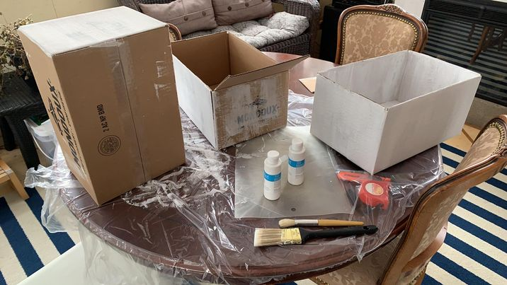
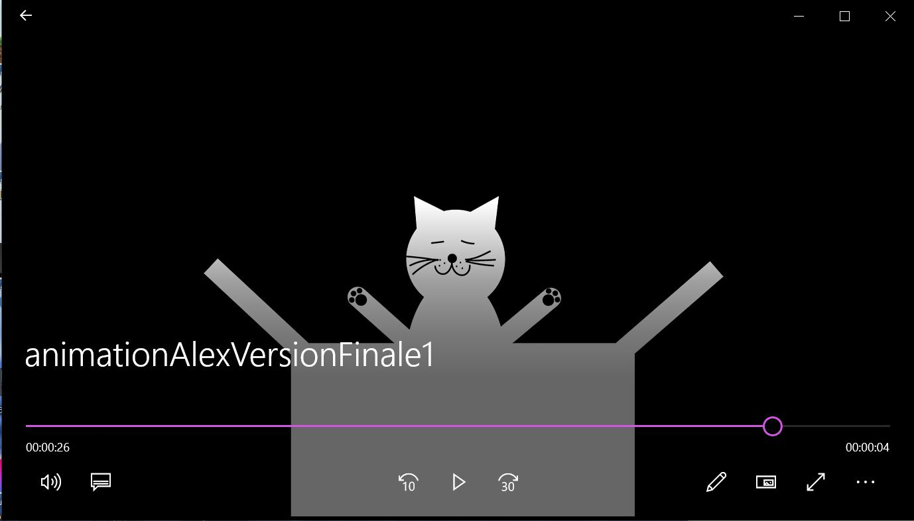

# Journal de "Alexandra"

## Table des matières
- [Semaine 0 (25 au 29 janvier)](#Semaine-0-(25-au-29-janvier))
- [Semaine 1 (30 janvier au 5 février)](#Semaine-1-(30-janvier-au-5-février))
- [Semaine 2 (6 au 12 février)](#Semaine-2-(6-au-12-février))
- [Semaine 3 (13 au 19 février)](#Semaine-3-(13-au-19-février))
- [Semaine 4 (20 au 26 février)](#Semaine-4-(20-au-26-février))
- [Semaine 5 (6 au 12 mars)](#Semaine-5-(6-au-12-mars))
- [Semaine 6 (13 au 19 mars)](#Semaine-6-(13-au-19-mars))

---
## Semaine 0 (25 au 29 janvier)

### Résumé des réalisations effectuées
- Hello, voici mon journal:))))))))
- Rien de spécial cette semaine
-Séparation des tâches et responsabilités
---
## Semaine 1 (30 janvier au 5 février)
### Résumé des réalisations effectuées
-Préproduction en équipe
-Budjet
-Échéancier avec les tâches (issues)
-Rôles dans l'équipe
-Calendrier des rencontres
-Finalisation de notre concept et projet

### Image d'une réalisation dont tu es la ou le plus fier
-Rien cette semaine

### Est-ce que j'ai accompli l'ensemble des tâches et objectifs que je m'étais fixés pour cette semaine?

- [x] Complètement
- [ ] Assez
- [ ] Peu
- [ ] Pas du tout

#### Décrivez pourquoi.
 J'ai terminée ma partie de la préprod et je me sens prête à accomplir le projet.

#### S'il y a lieu, qu'allez-vous faire pour remédier à la situation?

### Mon projet s'est-il réalisé selon l’échéancier prévu?

- [x] Complètement
- [ ] Assez
- [ ] Un peu
- [ ] Pas tout à fait

#### S'il y a des écarts, décrivez-les.

#### S'il y a lieu, qu'allez-vous faire pour remédier à la situation?

### Défis pour la prochaine semaine
- Réapprendre à utiliser Illustrator et After effect.

---
## Semaine 2 (6 au 12 février)
### Résumé des réalisations effectuées
- Essayer de me connecter au VPN
- Comité Diffusion

### Image d'une réalisation dont tu es la ou le plus fier
 * Image de moi frustré devant mon ordinateur*

### Est-ce que j'ai accompli l'ensemble des tâches et objectifs que je m'étais fixés pour cette semaine?

- [ ] Complètement
- [ ] Assez
- [ ] Peu
- [x] Pas du tout

#### Décrivez pourquoi.
 Je n'ai pas été capable de me connecter, même avec de l'aide.

#### S'il y a lieu, qu'allez-vous faire pour remédier à la situation?
Travailler plus et continuer d'essayer avec l'aide de Cédrick.

### Mon projet s'est-il réalisé selon l’échéancier prévu?

- [ ] Complètement
- [ ] Assez
- [ ] Un peu
- [x] Pas tout à fait

#### S'il y a des écarts, décrivez-les.
J'étais supposé avoir commencer mon animation.

#### S'il y a lieu, qu'allez-vous faire pour remédier à la situation?
Travailler plus.

### Défis pour la prochaine semaine
Faire mon animation et commencer notre installation au collège.
---
## Semaine 3 (13 au 19 février)
### Résumé des réalisations effectuées
- Installation d'un projecteur
- Plusieurs tests en personne au studio
- Me connecter au VPN
- Peinturer une boite sur les trois
- Faire des faux fonds pour les boites

### Image d'une réalisation dont tu es la ou le plus fier

### Est-ce que j'ai accompli l'ensemble des tâches et objectifs que je m'étais fixés pour cette semaine?

- [ ] Complètement
- [x] Assez
- [ ] Peu
- [ ] Pas du tout

#### Décrivez pourquoi.
 - Je pensais avoir plus de temps pour mes animations, mais j'ai du prioriser d'autre chose.

#### S'il y a lieu, qu'allez-vous faire pour remédier à la situation?
- Prendre au moins une journée dédié à mon animation.

### Mon projet s'est-il réalisé selon l’échéancier prévu?

- [x] Complètement
- [ ] Assez
- [ ] Un peu
- [ ] Pas tout à fait

#### S'il y a des écarts, décrivez-les.

#### S'il y a lieu, qu'allez-vous faire pour remédier à la situation?

### Défis pour la prochaine semaine
- Faire fonctionner les différentes parties de notre installation et finir de peinturer les boites.
---
## Semaine 4 (20 au 26 février)
### Résumé des réalisations effectuées
- Installation et branchement des 2 projecteurs
- Ajustement des boites que j'ai peinturées
- Préparation et présentation du prototype
- Faire mon animation

### Image d'une réalisation dont tu es la ou le plus fier

### Est-ce que j'ai accompli l'ensemble des tâches et objectifs que je m'étais fixés pour cette semaine?

- [x] Complètement
- [ ] Assez
- [ ] Peu
- [ ] Pas du tout

#### Décrivez pourquoi.
 - Notre prototype d'installation était prêt à temps et j'ai enfin complété mon animation.

#### S'il y a lieu, qu'allez-vous faire pour remédier à la situation?

### Mon projet s'est-il réalisé selon l’échéancier prévu?

- [ ] Complètement
- [x] Assez
- [ ] Un peu
- [ ] Pas tout à fait

#### S'il y a des écarts, décrivez-les.
- Ils nous manquaient du matériel pour l'aspect sonore de notre installation.

#### S'il y a lieu, qu'allez-vous faire pour remédier à la situation?
- Attendre d'avoir le matériel.

### Défis pour la prochaine semaine
-Perfectionner mon animation et nous préparer au retour au studio.
---
## Semaine de rattrapage (27 février au 5 mars)

---
## Semaine 5 (6 au 12 mars)
### Résumé des réalisations effectuées

### Image d'une réalisation dont tu es la ou le plus fier

### Est-ce que j'ai accompli l'ensemble des tâches et objectifs que je m'étais fixés pour cette semaine?

- [ ] Complètement
- [ ] Assez
- [ ] Peu
- [ ] Pas du tout

#### Décrivez pourquoi.
 

#### S'il y a lieu, qu'allez-vous faire pour remédier à la situation?

### Mon projet s'est-il réalisé selon l’échéancier prévu?

- [ ] Complètement
- [ ] Assez
- [ ] Un peu
- [ ] Pas tout à fait

#### S'il y a des écarts, décrivez-les.

#### S'il y a lieu, qu'allez-vous faire pour remédier à la situation?

### Défis pour la prochaine semaine

---
## Semaine 6 (13 au 19 mars)
### Résumé des réalisations effectuées

### Image d'une réalisation dont tu es la ou le plus fier

### Est-ce que j'ai accompli l'ensemble des tâches et objectifs que je m'étais fixés pour cette semaine?

- [ ] Complètement
- [ ] Assez
- [ ] Peu
- [ ] Pas du tout

#### Décrivez pourquoi.
 

#### S'il y a lieu, qu'allez-vous faire pour remédier à la situation?

### Mon projet s'est-il réalisé selon l’échéancier prévu?

- [ ] Complètement
- [ ] Assez
- [ ] Un peu
- [ ] Pas tout à fait

#### S'il y a des écarts, décrivez-les.

#### S'il y a lieu, qu'allez-vous faire pour remédier à la situation?

### Défis pour la prochaine semaine
