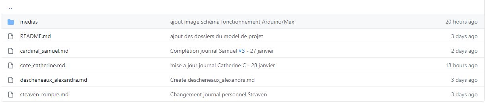
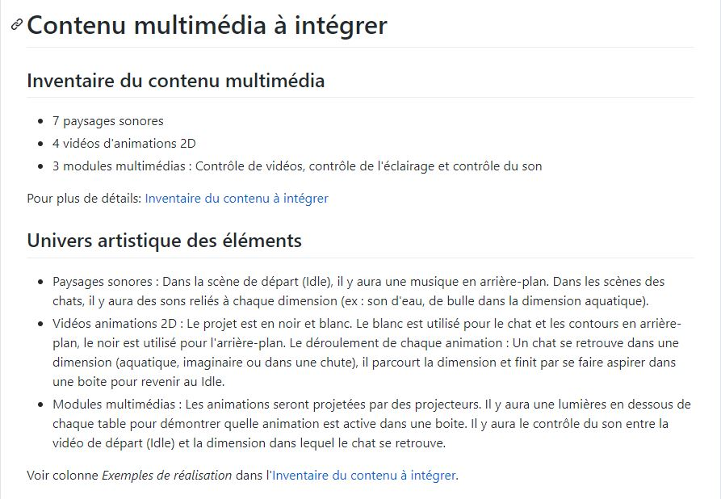
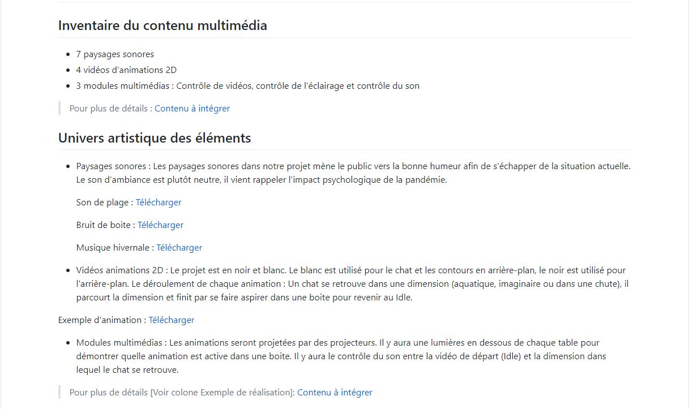

# Journal de "Steaven Rompré"

## Table des matières
- [Semaine 0 (25 au 29 janvier)](#Semaine-0-(25-au-29-janvier))
- [Semaine 1 (30 janvier au 5 février)](#Semaine-1-(30-janvier-au-5-février))
- [Semaine 2 (6 au 12 février)](#Semaine-2-(6-au-12-février))
- [Semaine 3 (13 au 19 février)](#Semaine-3-(13-au-19-février))
- [Semaine 4 (20 au 26 février)](#Semaine-4-(20-au-26-février))
- [Semaine 5 (6 au 12 mars)](#Semaine-5-(6-au-12-mars))
- [Semaine 6 (13 au 19 mars)](#Semaine-6-(13-au-19-mars))

---
## Semaine 0 (25 au 29 janvier)

### Résumé des réalisations effectuées
- J'ai désigné mon journal personnel et j'ai renommé le nom de fichier pour l'étudiant 04.

### Image d'une réalisation dont tu es la ou le plus fier

### Est-ce que j'ai accompli l'ensemble des tâches et objectifs que je m'étais fixés pour cette semaine?	
- [x] Complètement
- [ ] Assez
- [ ] Peu
- [ ] Pas du tout

#### Décrivez pourquoi.
Je suis toutefois fier d'avoir accomplis cette réalisation, car c'est difficile pour moi d'assimiler Github, j'ai toujours eu une certaine difficulté avec cette interface.  

#### S'il y a lieu, qu'allez-vous faire pour remédier à la situation?
Aucunes information.

### Mon projet s'est-il réalisé selon l’échéancier prévu?

- [x] Complètement
- [ ] Assez
- [ ] Un peu
- [ ] Pas tout à fait

#### S'il y a des écarts, décrivez-les.
Moi et les membre de mon équipe avons eu la chance de pouvoir discuter à propos de notre projet et des étapes que nous allions franchir éventuellement. Il reste à compléter la préproduction du projet. 

#### S'il y a lieu, qu'allez-vous faire pour remédier à la situation?
Aucunes informations.

### Défis pour la prochaine semaine
Mon équipe et moi allons remplir la préproduction qui est à remettre pour la semaine prochaine.

---
## Semaine 1 (30 janvier au 5 février)
### Résumé des réalisations effectuées
- J'ai remplis la section qui m'était désigné dans la préproduction et le tableau dans Excel
- Participation à la réunion technique
- Organiser les dates de réunion avec mon équipe et de ce que nous avions besoin en matériel

### Image d'une réalisation dont tu es la ou le plus fier

### Est-ce que j'ai accompli l'ensemble des tâches et objectifs que je m'étais fixés pour cette semaine?

- [ ] Complètement
- [x] Assez
- [ ] Peu
- [ ] Pas du tout

#### Décrivez pourquoi.
 - J'ai accomplit tout ce que j'avais à faire pour cette semaine, par contre, il manque quelques informations qui étaient plus ou moins claires avec mon équipe.

#### S'il y a lieu, qu'allez-vous faire pour remédier à la situation?
- Pour remédier à la situation, je vais rajouter les éléments manquant dans ma section de la préproduction.

### Mon projet s'est-il réalisé selon l’échéancier prévu?

- [x] Complètement
- [ ] Assez
- [ ] Un peu
- [ ] Pas tout à fait

#### S'il y a des écarts, décrivez-les.
Aucunes informations.

#### S'il y a lieu, qu'allez-vous faire pour remédier à la situation?
Aucunes informations.

### Défis pour la prochaine semaine
- Le défi pour la semaine prochaine, pour ma part, sera de finaliser ma section de la préproduction et d'aider mon équipe en cas de besoin.
- Commencer à chercher pour des matériaux à utiliser pour le projet et calculer le prix.

---
## Semaine 2 (6 au 12 février)
### Résumé des réalisations effectuées
- Finir ma partie de la préproduction
- Continuer les animations

### Image d'une réalisation dont tu es la ou le plus fier

### Est-ce que j'ai accompli l'ensemble des tâches et objectifs que je m'étais fixés pour cette semaine?

- [ ] Complètement
- [ ] Assez
- [x] Peu
- [ ] Pas du tout

#### Décrivez pourquoi.
 - Je m'étais mis comme réalisation d'avancer mes deux animations, voir les terminer. Par contre, j'en ai seulement avancé une dont je n'ai pas encore terminé.

#### S'il y a lieu, qu'allez-vous faire pour remédier à la situation?
- Du fait qu'il n'aille plus la préproduction à faire pour la prochaine semaine, je vais pouvoir me concentrer d'avantage sur mes animations.

### Mon projet s'est-il réalisé selon l’échéancier prévu?

- [ ] Complètement
- [x] Assez
- [ ] Un peu
- [ ] Pas tout à fait

#### S'il y a des écarts, décrivez-les.
- Le délai que je m'étais fixé pour faire mes animations est rallongé d'une semaine.

#### S'il y a lieu, qu'allez-vous faire pour remédier à la situation?
- Je vais faire mes animations et les terminer.

### Défis pour la prochaine semaine
- Mon plus grand défi pour la semaine prochaine est d'avoir terminé mes deux animations.
- Commencer à monter notre projet au grand studio.
---
## Semaine 3 (13 au 19 février)
### Résumé des réalisations effectuées
- Acheter les matériaux nécessaires pour le projet
- Commencer à monter le projet au grand-studio
- Animation

### Image d'une réalisation dont tu es la ou le plus fier

### Est-ce que j'ai accompli l'ensemble des tâches et objectifs que je m'étais fixés pour cette semaine?

- [ ] Complètement
- [x] Assez
- [ ] Peu
- [ ] Pas du tout

#### Décrivez pourquoi.
 - Nous avons assez bien avancé le montage de notre projet dans le grand-studio. Le matériel est déjà tout acheté et les tables sont fabriqués. Je n'ai pas énormément touché aux animations par le fait que nous étions assez chargés cette semaine.

#### S'il y a lieu, qu'allez-vous faire pour remédier à la situation?
- Je vais avancé les animations en fin de semaine.

### Mon projet s'est-il réalisé selon l’échéancier prévu?

- [ ] Complètement
- [x] Assez
- [ ] Un peu
- [ ] Pas tout à fait

#### S'il y a des écarts, décrivez-les.
- Par la grande charge du montage du projet au collège, les animations ont peu avancés cette semaine.

#### S'il y a lieu, qu'allez-vous faire pour remédier à la situation?
- Je vais avancer les animations cette fin de semaine.

### Défis pour la prochaine semaine
- S'assurer que tout fonctionne dans notre projet pour mardi
- Avancer les animations
- Tester notre projet
---
## Semaine 4 (20 au 26 février)
### Résumé des réalisations effectuées

### Image d'une réalisation dont tu es la ou le plus fier

### Est-ce que j'ai accompli l'ensemble des tâches et objectifs que je m'étais fixés pour cette semaine?

- [ ] Complètement
- [ ] Assez
- [ ] Peu
- [ ] Pas du tout

#### Décrivez pourquoi.
 

#### S'il y a lieu, qu'allez-vous faire pour remédier à la situation?

### Mon projet s'est-il réalisé selon l’échéancier prévu?

- [ ] Complètement
- [ ] Assez
- [ ] Un peu
- [ ] Pas tout à fait

#### S'il y a des écarts, décrivez-les.

#### S'il y a lieu, qu'allez-vous faire pour remédier à la situation?

### Défis pour la prochaine semaine

---
## Semaine de rattrapage (27 février au 5 mars)
### Résumé des réalisations effectuées

### Image d'une réalisation dont tu es la ou le plus fier

### Est-ce que j'ai accompli l'ensemble des tâches et objectifs que je m'étais fixés pour cette semaine?

- [ ] Complètement
- [ ] Assez
- [ ] Peu
- [ ] Pas du tout

#### Décrivez pourquoi.
 

#### S'il y a lieu, qu'allez-vous faire pour remédier à la situation?

### Mon projet s'est-il réalisé selon l’échéancier prévu?

- [ ] Complètement
- [ ] Assez
- [ ] Un peu
- [ ] Pas tout à fait

#### S'il y a des écarts, décrivez-les.

#### S'il y a lieu, qu'allez-vous faire pour remédier à la situation?

### Défis pour la prochaine semaine

---
## Semaine 5 (6 au 12 mars)
### Résumé des réalisations effectuées

### Image d'une réalisation dont tu es la ou le plus fier

### Est-ce que j'ai accompli l'ensemble des tâches et objectifs que je m'étais fixés pour cette semaine?

- [ ] Complètement
- [ ] Assez
- [ ] Peu
- [ ] Pas du tout

#### Décrivez pourquoi.
 

#### S'il y a lieu, qu'allez-vous faire pour remédier à la situation?

### Mon projet s'est-il réalisé selon l’échéancier prévu?

- [ ] Complètement
- [ ] Assez
- [ ] Un peu
- [ ] Pas tout à fait

#### S'il y a des écarts, décrivez-les.

#### S'il y a lieu, qu'allez-vous faire pour remédier à la situation?

### Défis pour la prochaine semaine

---
## Semaine 6 (13 au 19 mars)
### Résumé des réalisations effectuées

### Image d'une réalisation dont tu es la ou le plus fier

### Est-ce que j'ai accompli l'ensemble des tâches et objectifs que je m'étais fixés pour cette semaine?

- [ ] Complètement
- [ ] Assez
- [ ] Peu
- [ ] Pas du tout

#### Décrivez pourquoi.
 

#### S'il y a lieu, qu'allez-vous faire pour remédier à la situation?

### Mon projet s'est-il réalisé selon l’échéancier prévu?

- [ ] Complètement
- [ ] Assez
- [ ] Un peu
- [ ] Pas tout à fait

#### S'il y a des écarts, décrivez-les.

#### S'il y a lieu, qu'allez-vous faire pour remédier à la situation?

### Défis pour la prochaine semaine
