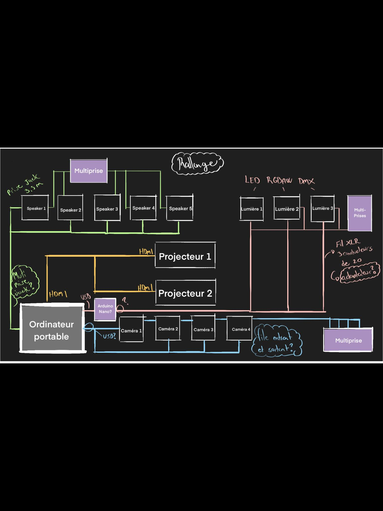

# Préproduction
> C'est ici qu'on dépose les éléments de la préproduction.

> Au besoin, se référer à l'[Appel de projet](https://cmontmorency365.sharepoint.com/:w:/s/TIM-58266B-Expriencemultimdiainteractive-Enseignants/EQ3PqvTQPzFDnpeccqWYOAgBZowMn5-3gtl0I_OxsEGC-Q?e=DuUbuG), au [Plan de cours](https://cmontmorency365.sharepoint.com/:w:/s/TIM-58266B-Expriencemultimdiainteractive-Enseignants/EWLLhctc9WZJiDCSjlMXcFoBA9fMhQRS4PHbGXHCH2Irxw?e=qGOnLf) et à la [Grille d'évaluation de la préproduction](https://cmontmorency365.sharepoint.com/:w:/s/TIM-58266B-Expriencemultimdiainteractive-Enseignants/ETcbkxD6vp1EmhhiZ3Di5_sBZwSyqisa7s3543kMy28dSg?e=gnu6Bt).

# Table des matières
1. [Intention ou concept](#Intention-ou-concept)
    - [Synopsis](#Synopsis)
    - [Intention de départ](#Intention-de-départ)
    - [Tableau d'ambiance (*moodboard*)](#Tableau-d'ambiance-(*moodboard*))
    - [Scénario, scénarimage ou document audio/visuel](#Scénario,-scénarimage-ou-document-audio/visuel)
2. [Contenu multimédia à intégrer](#Contenu-multimédia-à-intégrer)
    - [Inventaire du contenu multimédia](#Inventaire-du-contenu-multimédia)
    - [Univers artistique des éléments](#Univers-artistique-des-éléments-centraux)
3. [Planification technique (devis technique)](#Planification-technique-(devis-technique))
    - [Schémas ou plans techniques](#Schémas-ou-plans-techniques)
    - [Matériaux requis](#Matériaux-de-scénographie-requis)
    - [Équipements requis](#Équipements-requis)
    - [Logiciels requis](#Logiciels-requis)
    - [Ressources humaines requises](#Ressources-humaines-requises)
    - [Ressources spatiales requises (rangement et locaux)](#Ressources-spatiales-requises-(rangement-et-locaux))
4. [Planification de la production (budget et étapes de réalisation)](#Planification-de-la-production-(budget-et-étapes-de-réalisation))
    - [Budget prévisionnel](#Budget-prévisionnel)
    - [Échéancier global](#Échéancier-global)
    - [Liste des tâches à réaliser](#Liste-des-tâches-à-réaliser)
    - [Rôles et responsabilités des membres de l'équipe](#Rôles-et-responsabilités-des-membres-de-l'équipe))
    - [Moments des rencontres d'équipe](#Moments-des-rencontres-d'équipe)

# Intention ou concept
## Synopsis
Notre projet consiste en une projection d’animations sous le thème de chats s’affichant dans l’une des trois boîtes dans la pièce. Le spectateur sera incité à s'approcher de la boîte par des sons et lumières provenant de celle-ci. Il pourra observer un chat animé dans le fond de la boîte. Ce même processus se répète plusieurs fois entre trois différentes boîtes, et ce de façon aléatoire. Le spectateur sera guidé de la même façon (par la vidéo, la lumière et le son), mais présentera des vidéos d’animations différentes à l’intérieur des boîtes.

## Intention de départ
Notre projet a pour but de rassembler à distance les gens et de les divertir par son aspect ludique et réconfortant, c'est-à-dire un monde imaginaire et onirique. Nous voulons que les gens se délaissent de leurs angoisses du monde réel. 

## Tableau d'ambiance (*moodboard*)
[Tableau d'ambiance visuels (images, couleurs)](https://github.com/samcard01/les_chatoyants/blob/main/images/preuves/moodboard_projetSynthese.jpg)

## Scénario, scénarimage ou document audio/visuel
[Scénarimage visuel pour vidéo d'animation de Samuel](https://github.com/samcard01/les_chatoyants/blob/main/images/storyboard/scenarimage_sam.PNG)

[Scénarimage visuel pour vidéo d'animation d'Alexandra](https://github.com/samcard01/les_chatoyants/blob/main/images/storyboard/scenarimage_alex.PNG)

[Scénarimage visuel pour vidéo d'animation de Catherine 1](https://github.com/samcard01/les_chatoyants/blob/main/images/storyboard/scenarimage_cath1.PNG)

[Scénarimage visuel pour vidéo d'animation de Catherine 2](https://github.com/samcard01/les_chatoyants/blob/main/images/storyboard/scenarimage_cath2.PNG)

[Scénarimage visuel pour vidéo d'animation de Steaven](https://github.com/samcard01/les_chatoyants/blob/main/images/storyboard/scenarimage_steaven.PNG)

# Contenu multimédia à intégrer
## Inventaire du contenu multimédia

- 15 icônes de navigation (pour les utilisateur-trices)
- 8 montages d'image
- 3 paysages sonores
- 5 vidéos d'animation 2D
- 3 textes poétiques
- 7 modules multimédias (ex. captation des données, interprétation des données, contrôle d'éclairage, effets audiovisuels, contrôle vidéo, contrôle de la navigation utilisateur & des différents sous-modules, diffusion et interaction en ligne...).
- ...

Pour plus de détails: [Inventaire du contenu à intégrer](https://cmontmorency365.sharepoint.com/sites/TIM-58266B-Expriencemultimdiainteractive-Enseignants/_layouts/15/Doc.aspx?OR=teams&action=edit&sourcedoc={8D242B82-E599-49CF-BE4C-EA9539D2D1C3})

## Univers artistique des éléments
Voir colonne *Exemples de réalisation* dans l'[Inventaire du contenu à intégrer](https://cmontmorency365.sharepoint.com/sites/TIM-58266B-Expriencemultimdiainteractive-Enseignants/_layouts/15/Doc.aspx?OR=teams&action=edit&sourcedoc={8D242B82-E599-49CF-BE4C-EA9539D2D1C3}).

# Planification technique (devis technique)
## Schémas ou plans techniques
> Insérer plans, documents et schémas pertinents dans cette sectio.  

### Schéma de branchement

### Schéma de fonctionnement

### Plantation 

## Matériel de scénographie requis

> Liste des matériaux de scénographie (matériaux de décor) requis ou lien vers un tableur Excel ou document Markdown à part si nécessaire (quantité, spécifications techniques, lien vers fiche technique si applicable, commentaires...)

* table
    * 30 x 30 x 100 cm ~
    * Quantité [3]
* nape ou drap
    * 180 x 290 cm
    * Couleur blanc
    * Quantité [3]
* boite
    * 20" (comme un éran) (50,8 cm), IPS, Large (16:9)
    * Quantité [3]

## Équipements requis
> Liste des équipements requis pour le projet [en cours...]

* Audio
    * 5 haut-parleurs
    * adaptateur pour brancher à l'ordi plusieur speaker (jack mini ou USB?)

* Vidéo
    * 2 projecteurs vidéo lentille standard
    * 2 système d'acrochage
    * 4 caméra
    * 4 trépieds
    * 4 fils pour charger la batterie au mur
    * fil pour afficher sur l'ordinateur? (pour la diffusion)

* Lumière
    * 3 lumière LED RGBAW DMX
    * 3 fils XLR 3 conducteurs de 20'
    * adaptateur pour brancher les LED au arduino Nano

* Électricité
    * 10 cordon IEC (pour l'alimentation des haut-parleurs)
    * 3 multiprise (son/lumière/caméra diffusion)
    * ~ rallonges

* Réseau??
    * 4 fils cat6a de 15"
    * Switch poe 5 ports

* Ordinateur
    * 1 ordinateur portable 
    
* Autre
    * Arduino Nano

## Logiciels requis
> Liste des logiciels requis, version ainsi que leurs dépendences

* [Illustrator 2021](https://www.adobe.com/products/illustrator.html) 
* [Max 8](https://cycling74.com/products/max)   
* [after effect 2021](https://www.adobe.com/products/aftereffects.html)
* [premiere 2021](https://www.adobe.com/products/premiere.html)
* [storyboarder 1.0.0](https://wonderunit.com/storyboarder/)
* [Arduino IDE 1.8.13](https://www.arduino.cc/)

## Ressources humaines requises
> Moments et fonctions où une intervention humaine externe à l'équipe est nécessaire et pourquoi. Formaté en liste ou en lien vers un tableur Excel.

* 15 février, TTP, location de matériel 
* 26 mars, TTP, retour du matériel

## Ressources spatiales requises (rangement et locaux)
> Moments et spécifications des espaces utilisés formaté en liste ou lien vers un tableur Excel.

* Grand studio
    * 15 février
        * installation de l'équipement
        * 6 heures
    * 16 février au 25 mars
        * stockage de l'équipement et installation
        * ~ heures
    * 26 mars
        * Démontage
        * 3 heures
    

    
# Planification de la production (budget et étapes de réalisation)
## Budget prévisionnel

[Lien vers document](https://cmontmorency365.sharepoint.com/:x:/s/TIM-58266B-Expriencemultimdiainteractive-Enseignants/ERS3zx4iKAlLn03N_0h3cyQBOV_nxNuKvrKnqmrXGcgDYg?e=Rjq9Uc)

## Échéancier global
Étapes importantes du projet visualisé dans GitHub (*milestones*):  
https://github.com/tim-montmorency/66B-modele_de_projet/milestones

*Dates importantes de diffusion :*
- Pratique générale : 19 mars (toute la journée)
- Début de la diffusion : lundi 22 mars
- Présentation des projets devant public : jeudi 25 mars (soir)

## Liste des tâches à réaliser
Visualisation des tâches à réaliser dans GitHub selon la méthode Kanban:  
https://github.com/tim-montmorency/66B-modele_de_projet/projects/2?add_cards_query=is%3Aopen

Inventaire des tâches à réaliser dans GitHub selon le répertoire d'*issues*:  
https://github.com/tim-montmorency/66B-modele_de_projet/issues

## Rôles et responsabilités des membres de l'équipe
> Il vous est proposé ici de nommer une personne à la coordination générale du projet, à la coordination technique, à la coordination de la diffusion et à la coordination artistique. Les grandes décisions sur les grandes orientations du projet devraient se prendre en groupe lors des rencontres d'équipe quotidiennes et hebdomadaires. Cependant, les décisions entre vos rencontres de groupe devraient appartenir à ces personnes.

**Étudiant E**
- Coordination générale du projet (coordination de l'échéancier, du budget, suivi de la liste des tâches à réaliser, s'assurer de la répartition du rôle et des responsabilités des membres de l'équipe);
- Création du module d'interprétation des données;
- Programmation du module Max de contrôle vidéo.

Liste des tâches dans Git Hub:  
https://github.com/tim-montmorency/66B-modele_de_projet/issues/assigned/DarylMomo  
https://github.com/tim-montmorency/66B-modele_de_projet/projects/2?card_filter_query=assignee%3Adarylmomo

**Étudiant D**
- Comité Technique et coordination technique (suivi du devis technique);
- Création des paysages sonores sonores;
- Programmation du module Max d'effet et de contrôle audio;
- Installation de l'équipement dans l'espace physique.

Liste des tâches dans Git Hub:  
https://github.com/tim-montmorency/66B-modele_de_projet/issues/assigned/gllmAR
https://github.com/tim-montmorency/66B-modele_de_projet/projects/2?card_filter_query=assignee%3Agllmar

**Étudiant C**
- Comité Diffusion et coordination de la diffusion (mise en ligne du Site Web, organisation de la plateforme et de l'événement de diffusion);
- Installation et mise en place de la capture audiovidéo du projet en temps réel;
- Programmation du module de captation des données;
- Programmation du module de diffusion et d'interaction en ligne (page Web, diffusion vidéo dans Twitch via OBS, interface utilisateur dans Open Stage Control).

Liste des tâches dans Git Hub:  
https://github.com/tim-montmorency/66B-modele_de_projet/issues/assigned/DarylMomo  
https://github.com/tim-montmorency/66B-modele_de_projet/projects/2?card_filter_query=assignee%3Adarylmomo

**Étudiant B**
- Coordination artistique (attention plus particulière pour s'assurer que l'intention/concept artistique du projet initial reste, sinon consulter les membres de l'équipe);
- Création des textes poétiques;
- Création des vidéos d'animation 2D;
- Programmation du module Unity d'effets visuels et intégration dans Max.

Liste des tâches dans Git Hub:  
https://github.com/tim-montmorency/66B-modele_de_projet/issues/assigned/gllmAR
https://github.com/tim-montmorency/66B-modele_de_projet/projects/2?card_filter_query=assignee%3Agllmar

**Étudiant A**
- Création des images;
- Création des icônes de navigation;
- Programmation du module Max d'éclairage;
- Programmation du module Max de contrôle de la navigation utilisateur & des différents sous-modules.

Liste des tâches dans Git Hub:  
https://github.com/tim-montmorency/66B-modele_de_projet/issues/assigned/DarylMomo  
https://github.com/tim-montmorency/66B-modele_de_projet/projects/2?card_filter_query=assignee%3Adarylmomo

**Tâches pas encore attribuées**  
https://github.com/tim-montmorency/66B-modele_de_projet/issues?q=is%3Aopen+is%3Aissue+no%3Aassignee

## Moments des rencontres d'équipe
Quotidien
- **Chaque jour 9h00 (30min max)**: Rencontre statutaire d'équipe pour régler les urgences

Hebdomadaire
- **Mardi "x"h (environ 1h)** : Rencontre d'équipe avec professeur
- **Vendredi 9h50 (environ 2h)** : Rencontre générale de classe
- **Vendredi 13h (environ 2h)** : Rencontre de mise à jour d'équipe (Journal Web, suivis, mise à jour de l'échéancier, partage des tâches et autres)

Autre: 
- **Jeudi 10h (environ 1h30)** : Comité Diffusion
- **Jeudi 14h (environ 1h30)** : Comité Technique
