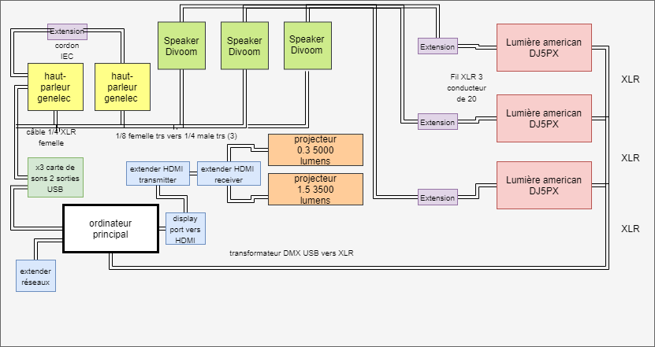
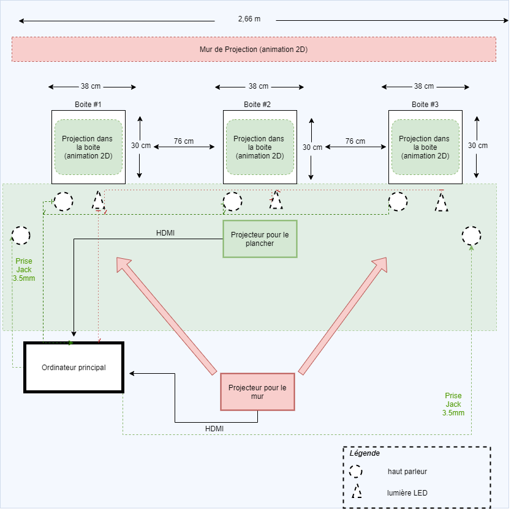

# Préproduction
> C'est ici qu'on dépose les éléments de la préproduction.

> Au besoin, se référer à l'[Appel de projet](https://cmontmorency365.sharepoint.com/:w:/s/TIM-58266B-Expriencemultimdiainteractive-Enseignants/EQ3PqvTQPzFDnpeccqWYOAgBZowMn5-3gtl0I_OxsEGC-Q?e=DuUbuG), au [Plan de cours](https://cmontmorency365.sharepoint.com/:w:/s/TIM-58266B-Expriencemultimdiainteractive-Enseignants/EWLLhctc9WZJiDCSjlMXcFoBA9fMhQRS4PHbGXHCH2Irxw?e=qGOnLf) et à la [Grille d'évaluation de la préproduction](https://cmontmorency365.sharepoint.com/:w:/s/TIM-58266B-Expriencemultimdiainteractive-Enseignants/ETcbkxD6vp1EmhhiZ3Di5_sBZwSyqisa7s3543kMy28dSg?e=gnu6Bt).

# Table des matières
1. [Intention ou concept](#Intention-ou-concept)
    - [Synopsis](#Synopsis)
    - [Intention de départ](#Intention-de-départ)
    - [Tableau d'ambiance (*moodboard*)](#Tableau-d'ambiance-(*moodboard*))
    - [Scénario, scénarimage ou document audio/visuel](#Scénario,-scénarimage-ou-document-audio/visuel)
2. [Contenu multimédia à intégrer](#Contenu-multimédia-à-intégrer)
    - [Inventaire du contenu multimédia](#Inventaire-du-contenu-multimédia)
    - [Univers artistique des éléments](#Univers-artistique-des-éléments-centraux)
3. [Planification technique (devis technique)](#Planification-technique-(devis-technique))
    - [Schémas ou plans techniques](#Schémas-ou-plans-techniques)
    - [Matériaux requis](#Matériaux-de-scénographie-requis)
    - [Équipements requis](#Équipements-requis)
    - [Logiciels requis](#Logiciels-requis)
    - [Ressources humaines requises](#Ressources-humaines-requises)
    - [Ressources spatiales requises (rangement et locaux)](#Ressources-spatiales-requises-(rangement-et-locaux))
4. [Planification de la production (budget et étapes de réalisation)](#Planification-de-la-production-(budget-et-étapes-de-réalisation))
    - [Budget prévisionnel](#Budget-prévisionnel)
    - [Échéancier global](#Échéancier-global)
    - [Liste des tâches à réaliser](#Liste-des-tâches-à-réaliser)
    - [Rôles et responsabilités des membres de l'équipe](#Rôles-et-responsabilités-des-membres-de-l'équipe))
    - [Moments des rencontres d'équipe](#Moments-des-rencontres-d'équipe)

# Intention ou concept
## Synopsis

### Synopsis en présentiel
Un spectateur entre dans la salle et découvre l’univers onirique de celle-ci. Ce dernier voit le chat projeté sur le mur se diriger vers la boite de son choix. De ce fait, la boite s’illumine et des sons s’en émanent. Le spectateur s’en approche et découvre la projection à l’intérieur de celle-ci. Quand la projection se termine, le chat ressort de la boite et revient sur le mur. Le processus se répète deux autres fois. 

### Synopsis en ligne
Le principe sera le même en ligne, cependant le spectateur pourra choisir parmi les trois personnes suivantes : Mathis, 9 ans, Jasmine, 19 ans ainsi que Jacques, 46 ans. Selon le point de vue choisi, le spectateur va pouvoir explorer les univers différents, et ce, dans un ordre différent. Selon la personne choisie, la hauteur de la caméra va varier.

## Intention de départ
Dans ces temps difficiles, le projet des Chatoyants a pour but de rassembler les gens à distance, et ce dans un monde imaginaire et onirique. Notre projet apporte une source de réconfort par la présence chaleureuse des chats.

## Tableau d'ambiance (*moodboard*)

## Scénario, scénarimage ou document audio/visuel

### Scénarimage Alexandra

### Scénarimage Catherine

### Scénarimage Steaven

### Scénario en présentiel
1. INT. SOIR. GRAND STUDIO DU COLLÈGE MONTMORENCY

SAMUEL entre dans la salle.

La salle est relativement sombre. Des bruits de vents ressemblant à des bruits blancs se font entendre dans la salle et varient selon un intervalle de temps. Ces bruits jouent à un volume moyen.

Samuel se sent apaisé par l’atmosphère calme et paisible de la salle. Il voit un chat animé projeté sur le mur situé au fond de la salle.

Devant ce mur, il voit trois boîtes blanches situées l’une à côté de l’autre. Elles sont chacune sur une table recouverte d’une nappe blanche. Samuel voit de la lumière qui émane de chacune des boîtes. Cette lumière est douce et relativement faible. La lumière des boîtes éclaire la salle.

Après quelques instants, le chat situé sur le mur entre dans la première boîte située à la gauche de Samuel.

L’entrée du chat dans la boîte fait en sorte que la lumière provenant des deux autres boîtes s’éteint. Il ne reste plus que la lumière provenant de la première boîte qui s'émane. Samuel entend des bruits de bulles et d’éclaboussures d’eau provenant de la première boîte.

Intrigué, ce dernier décide de s’approcher de la boîte en question.

Lorsqu’il regarde à l’intérieur de cette dernière, il y voit un chat portant une sorte de scaphandre nager dans un aquarium. Le chat explore cet univers aquatique jusqu’à ce qu’il se fasse aspirer par une boîte située dans le fond de l’aquarium.

Quelques instants plus tard, le chat qui était entré dans la boîte en ressort et se dirige de nouveau sur le mur sur lequel il était au départ.

Samuel voit que les lumières des boîtes se rallument de nouveau et que l’univers venteux et abstrait de la pièce se remet de nouveau en marche.

Samuel se sent apaisé et à la fois intrigué par ce qu’il s’est passé dans la boîte.

Le chat sur le mur choisit une boîte de nouveau et le processus de l’expérience recommence de nouveau, et ce, deux autres fois.

### Scénario en ligne
1. INT. SOIR. GRAND STUDIO DU COLLÈGE MONTMORENCY (POV)

Le spectateur arrive sur la page du projet, Les Chatoyants. Pour vivre l'expérience, celui-ci doit choisir parmi les trois personnes suivantes : Mathis, 9 ans, Jasmine, 19 ans ainsi que Jacques, 46 ans.

Selon le point de vue choisi, le spectateur va pouvoir explorer les univers différents, et ce, dans un ordre différent. Selon la personne choisie, la hauteur de la caméra va varier.

Mathis/Jasmine/Jacques entre dans la salle. La salle est relativement sombre. Des bruits de vents ressemblant à des bruits blancs se font entendre dans la salle et varient selon un intervalle de temps. Ces bruits jouent à un volume moyen.

Mathis/Jasmine/Jacques se sent apaisé(e) par l’atmosphère calme et paisible de la salle. Mathis/Jasmine/Jacques voit un chat animé projeté sur le mur situé au fond de la salle. Devant ce mur, Mathis/Jasmine/Jacques voit trois boîtes blanches situées l’une à côté de l’autre. Elles sont chacune sur une table recouverte d’une nappe blanche. Mathis/Jasmine/Jacques voit de la lumière qui émane de chacune des boîtes. Cette lumière est douce et relativement faible. La lumière des boîtes éclaire la salle.

Après quelques instants, le chat situé sur le mur entre dans l'une des boîtes.

L’entrée du chat dans la boîte fait en sorte que la lumière provenant des deux autres boîtes s’éteint. Il ne reste plus que la lumière provenant de l'une des boîtes qui s'émane. Mathis/Jasmine/Jacques entend des bruits variant selon l'univers exploré provenant de la boîte.

Intrigué(e), Mathis/Jasmine/Jacques décide de s’approcher de la boîte en question.

Lorsque Mathis/Jasmine/Jacques regarde à l’intérieur de cette dernière, Mathis/Jasmine/Jacques y voit un chat explorant l'univers de la boîte.

Quelques instants plus tard, le chat qui était entré dans la boîte en ressort et se dirige de nouveau sur le mur sur lequel il était au départ.

Mathis/Jasmine/Jacques voit que les lumières des boîtes se rallument de nouveau et que l’univers venteux et abstrait de la pièce se remet de nouveau en marche.

Mathis/Jasmine/Jacques se sent apaisé(e) et à la fois intrigué(e) par ce qu’il s’est passé dans la boîte.

Le chat sur le mur choisit une boîte de nouveau et le processus de l’expérience recommence de nouveau, et ce, deux autres fois.

# Contenu multimédia à intégrer
## Inventaire du contenu multimédia

- 7 paysages sonores
- 4 vidéos d'animations 2D
- 3 modules multimédias : Contrôle de vidéos, contrôle de l'éclairage et contrôle du son

> Pour plus de détails :
[Contenu à intégrer](contenu_multimédia.xlsx)

## Univers artistique des éléments

- Paysages sonores : Les paysages sonores dans notre projet mène le public vers la bonne humeur afin de s'échapper de la situation actuelle. Le son d'ambiance est plutôt neutre, il vient rappeler l'impact psychologique de la pandémie. 

    Son de plage : [Télécharger](medias/Crisp_Ocean_Waves-Mike_Koenig-1486046376.wav)
    
    Bruit de boite : [Télécharger](medias/bruit_boite.wav)

    Musique hivernale : [Télécharger](medias/hivernale.mp3)

- Vidéos animations 2D : Le projet est en noir et blanc. Le blanc est utilisé pour le chat et les contours en arrière-plan, le noir est utilisé pour l'arrière-plan. Le déroulement de chaque animation : Un chat se retrouve dans une dimension (aquatique, imaginaire ou dans une chute), il parcourt la dimension et finit par se faire aspirer dans une boite pour revenir au Idle.

Exemple d'animation : [Télécharger](medias/chatoyant.aep)

- Modules multimédias : Les animations seront projetées par des projecteurs. Il y aura une lumières en dessous de chaque table pour démontrer quelle animation est active dans une boite. Il y aura le contrôle du son entre la vidéo de départ (Idle) et la dimension dans lequel le chat se retrouve.

> Pour plus de détails [Voir colone Exemple de réalisation]:
[Contenu à intégrer](contenu_multimédia.xlsx)

# Planification technique (devis technique)
## Schémas ou plans techniques
> Insérer plans, documents et schémas pertinents dans cette section.  

### Schéma de branchement

### Schéma de fonctionnement

### Plantation 

### Plan des 3 tables

## Matériel de scénographie requis

> Liste des matériaux de scénographie (matériaux de décor) requis ou lien vers un tableur Excel ou document Markdown à part si nécessaire (quantité, spécifications techniques, lien vers fiche technique si applicable, commentaires...)

#### IMPORTANT! L'artiste fournira tous le matériels de scénographies pour le projet
* Barrette 2 x 2 x 8 MILLSTEAD SPF SDRY [choix A]
    * 2 x 2 x 8
    * Quantité [5]
* Boite [choix B]
    * 30 x 30 x 30 cm ~
    * Quantité [3]
* nape
    * 180 x 290 cm
    * Couleur blanc
    * Quantité [3]
    * Important, doivent permettre une certaine circulation d'air.
* boite
    * 20" (comme un éran) (50,8 cm), IPS, Large (16:9)
    * Quantité [3]
* Studio acrylics Titanium White PA011
    * Quantité [2]

## Équipements requis
> Liste des équipements requis pour le projet pour plus de détail téléchargez le
[Formulaire d'emprunt](formulaire_emprunt.xlsx)
* Audio
    * 2 haut-parleurs Genelec 8010 8"
    * 3 speaker Divoom Airbeat-10
    * carte de sons Berhinger U-phoria 8 in 8 out
    * 2 câbles XLR
    * 1 cable 1/4 XLR femelle
    * 3 direct input box

* Vidéo
    * 1 projecteurs standard, ratio 1.5, 3500 lumens
    * 1 projecteurs ratio 0.3, 5000 lumens
    * 2 systèmes d'acrochage
    * 1 caméra A6000 (difusion)
    * 1 trépieds (diffusion)
    * 1 Adaptateur Sony ACPW20 pour série a6000 (diffusion)
    * 4 câbles HDMI
    * 2 extendeur HDMI
    * 1 câble micro HDMI vers HDMI 
    * 1 extender réseau 
    * 1 carte d'aquisition
    * 2 display port vers HDMI

* Lumière
    * 3 american DJ5PX HEX LED Par can
    * 3 fils XLR 3 conducteurs de 20'
    * Transformateur DMX USB vers XLR

* Électricité
    * 2 cordon IEC (pour l'alimentation des haut-parleurs Genelec)
    * 5 extension à 3 fiches (camera/extender reseau/boites)
    * 1 carte capture pour l'ordinateur

* Ordinateur
    * 1 ordinateur 
    

## Logiciels requis
> Liste des logiciels requis, version ainsi que leurs dépendences

* [Illustrator 2021](https://www.adobe.com/products/illustrator.html) 
* [Max 8](https://cycling74.com/products/max)   
* [after effect 2021](https://www.adobe.com/products/aftereffects.html)
* [premiere 2021](https://www.adobe.com/products/premiere.html)
* [storyboarder 1.0.0](https://wonderunit.com/storyboarder/)
* [OBS - Open Broadcaster Software 26.1](https://obsproject.com/fr/download)

## Ressources humaines requises
> Moments et fonctions où une intervention humaine externe à l'équipe est nécessaire et pourquoi. Formaté en liste ou en lien vers un tableur Excel.

* 15 février, TTP, location de matériel 
    * Nous aurons besoin du TTP pour pouvoir faire la location de notre matériel pour le projet
* 15 février, TTP, aide à l'installation si nécessaire
    * Nous aurons très certainement besoin à certain moment d'aide pour l'installation de notre matériel. Il sera bien d'avoir   quelqu'un dans les parages si un problème survient ou simplement si nous avons une question. 
* 26 mars, TTP, retour du matériel
    * Nous aurons besoin du TTP pour nous assisté à certain moment lors faire le démontage de notre installation. De plus, nous aurons besoin du TTP pour pouvoir faire le retour de notre matériel.
## Ressources spatiales requises (rangement et locaux)
> Moments et spécifications des espaces utilisés formaté en liste ou lien vers un tableur Excel.

* Grand studio
    * 15 février
        * installation de l'équipement
        * 6 heures
    * 16 février au 25 mars
        * stockage de l'équipement et installation
        * ~ heures
    * 26 mars
        * Démontage
        * 3 heures
    

    
# Planification de la production (budget et étapes de réalisation)
## Budget prévisionnel
[Budget fichier Excel](https://cmontmorency365-my.sharepoint.com/:x:/g/personal/1834377_cmontmorency_qc_ca/ETzvIb07UKJIrJ9MOXfEUKsBrpdCMpFUVTv_lzvq4-EjKQ?e=z6EZao)

## Échéancier global
Étapes importantes du projet visualisé dans GitHub (*milestones*):  
https://github.com/samcard01/les_chatoyants/milestones

*Dates importantes de diffusion :*
- Pratique générale : 19 mars (toute la journée)
- Début de la diffusion : lundi 22 mars
- Présentation des projets devant public : jeudi 25 mars (soir)

## Liste des tâches à réaliser
Visualisation des tâches à réaliser dans GitHub selon la méthode Kanban:  
https://github.com/samcard01/les_chatoyants/projects/1

Inventaire des tâches à réaliser dans GitHub selon le répertoire d'*issues*:  
https://github.com/samcard01/les_chatoyants/issues

## Rôles et responsabilités des membres de l'équipe

**Alexandra**
- Coordination générale du projet (coordination de l'échéancier, du budget, suivi de la liste des tâches à réaliser, s'assurer de la répartition du rôle et des responsabilités des membres de l'équipe);
- Comité Diffusion et coordination de la diffusion (mise en ligne du Site Web, organisation de la plateforme et de l'événement de diffusion);
- Création des images;
- Création d'une vidéo d'animation 2D;
- Création des paysages sonores sonores;
- Installation de l'équipement dans l'espace physique.
- Installation et mise en place de la capture audiovidéo du projet en temps réel;

Liste des tâches dans Git Hub: 
https://github.com/samcard01/les_chatoyants/issues/assigned/alexmai05
https://github.com/samcard01/les_chatoyants/projects/1?card_filter_query=assignee%3Aalexmai05

**Catherine**
- Comité Technique et coordination technique (suivi du devis technique);
- Programmation du module Max de contrôle vidéo.
- Programmation du module Max d'éclairage;
- Création des images;
- Création d'une vidéo d'animation 2D;
- Création des paysages sonores;
- Installation de l'équipement dans l'espace physique.
- Installation et mise en place de la capture audiovidéo du projet en temps réel;

Liste des tâches dans Git Hub:  
https://github.com/samcard01/les_chatoyants/issues/assigned/CatherineCote
https://github.com/samcard01/les_chatoyants/projects/1?card_filter_query=assignee%3Acatherinecote

**Samuel**
- Comité Diffusion et coordination de la diffusion (mise en ligne du Site Web, organisation de la plateforme et de l'événement de diffusion);
- Programmation du module Max d'effet et de contrôle audio;
- Création des icônes de navigation (thumbnail);
- Programmation du module de diffusion et d'interaction en ligne (page Web, diffusion vidéo dans Twitch via OBS, interface utilisateur dans Open Stage Control).
- Installation de l'équipement dans l'espace physique.
- Installation et mise en place de la capture audiovidéo du projet en temps réel;

Liste des tâches dans Git Hub:  
https://github.com/samcard01/les_chatoyants/issues/assigned/samcard01
https://github.com/samcard01/les_chatoyants/projects/1?card_filter_query=assignee%3Asamcard01

**Steaven**
- Coordination artistique (attention plus particulière pour s'assurer que l'intention/concept artistique du projet initial reste, sinon consulter les membres de l'équipe);
- Comité Technique et coordination technique (suivi du devis technique);
- Création des paysages sonores sonores;
- Création des images;
- Création de deux vidéos d'animation 2D;
- Installation de l'équipement dans l'espace physique.
- Installation et mise en place de la capture audiovidéo du projet en temps réel;

Liste des tâches dans Git Hub:
https://github.com/samcard01/les_chatoyants/issues/assigned/SteavenR
https://github.com/samcard01/les_chatoyants/projects/1?card_filter_query=assignee%3Asteavenr

**Pas clair**
- Programmation du module Max de contrôle de la navigation utilisateur & des différents sous-modules.

**Tâches pas encore attribuées**  
https://github.com/samcard01/les_chatoyants/issues?q=is%3Aopen+is%3Aissue+no%3Aassignee

## Moments des rencontres d'équipe

Hebdomadaire
- **Mardi 13h (environ 2h)** : Rencontre d'équipe
- **Mardi 15h (environ 1h)** : Rencontre d'équipe avec professeur
- **Mercredi 11h (environ 1h)** : Rencontre de mise à jour d'équipe (Journal Web, suivis, mise à jour de l'échéancier, partage des tâches et autres)
- **Jeudi 16h (Environ 15min)** : Rencontre de mise à jour d'équipe (Récapitulatif comité de diffusion et comité technique)
- **Vendredi 9h50 (environ 2h)** : Rencontre générale de classe

Autre: 
- **Jeudi 10h (environ 1h30)** : Comité Diffusion
- **Jeudi 14h (environ 1h30)** : Comité Technique
